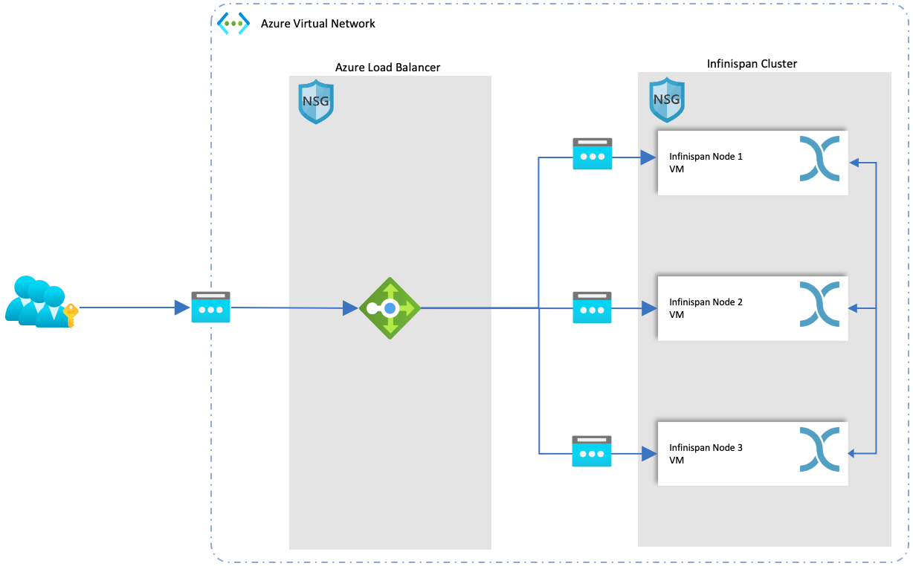
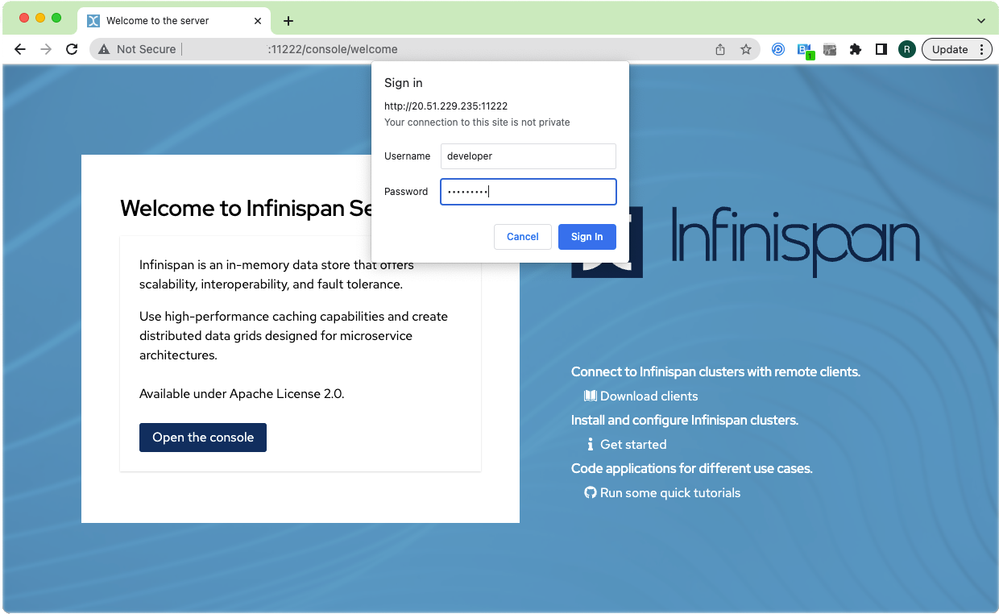
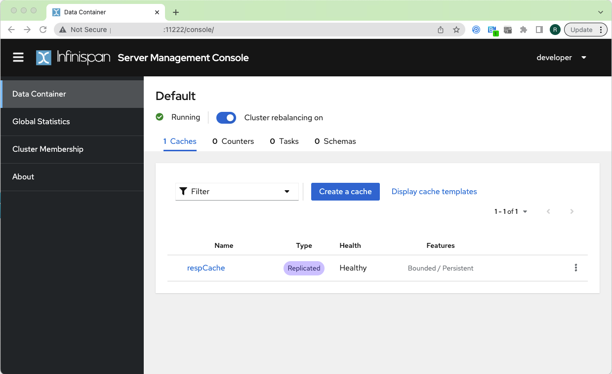

# Installing and Running Infinispan on Azure

**What is Infinispan?**
Infinispan is an open-source in-memory (key/value) data grid that provides fast data access with distributed caching capabilities. It can be used to store data in memory and offload the database for read-heavy applications. This tutorial we will see how to install and configure Infinispan on an Azure cloud platform in a three-node replicated cluster.

Infinispan is primarily used as a cache to improve system performance by reducing bottlenecks in apps and databases or even disk-based NoSQL stores. Infinispan also offers distributed caching to enhance cache coherency in clustered applications where data consistency is crucial. It can also work as a high performant NoSQL-based data store and can persist data to permanent stores using cache stores.

More details can be found @ https://infinispan.org/documentation/

## Prerequisite

 - Azure Account
 - Azure CLI
 - Basic understanding of Azure CLI
 - Java 8 or higher installed on the local machine
 - access to scp and ssh

## Architecture 




Infinispan supports various types of cache modes. In this tutorial, we will look at setting up Infinispan with replicated cache on Azure. As you can see in the diagram above there are Infinispan 3 nodes deployed on 3 Azure VMs. To access Infinispan we will use the external public IP of the Load Balancer. The diagram also shows 3 public ips belonging to each VM these are only needed for setting up Infinispan, once the server is up and running we can delete them and still be able to access the Infinispan cluster.
JGroups is an essential component of Infinispan, serving as the network transport layer that facilitates cluster formation and communication among nodes in a distributed system. Infinispan leverages JGroups to form a cluster of nodes, allowing them to communicate and share data seamlessly.


## Installing Infinispan on Azure

### Step1

 - Download the files (```createAzureResource.sh, setup-vm.sh & infinispan.xml```) present in the resource folder to a local folder.
 - Ensure you are logged into Azure using the CLI if not use ```az login``` to login to Azure.
 - Open the provided ```createAzureResource.sh``` file and update the ```resourceGroup``` variable on ```line 5``` with the resource group you want to use. If you do not have a resource group create one using ```az group create --name <<resourceGroup>> --location <<location>> --tags "<<tage>>"``` replace resourceGroup, location and tags as appropriate.
 - (Optional) Change other variables as appropriate in the ```createAzureResource.sh``` file. 
 - Run the ```createAzureResource.sh``` shell script this will create the necessary resources on Azure and also provide the commands for setting up Infinispan cluster on the Azure VM's.
 - By default the script creates ```3 VMs``` this is controlled by the ```numVM``` parameter, change this as appropriate


### Step 2 
Once ```createAzureResource.sh```completes it outputs the below commands for all the VMs that were created:
 - **```scp infinispan.xml setup-vm.sh dguser@<<PUBLIC_IP>>:```** (public ip of the VM will be populated) command will copy the files from your local file system to the Azure VM. When prompted use ```GRIDP@ssw0rd``` to login into the VM. The user name and password are controlled by the ```login and pwd``` variable in the ```createAzureResource.sh``` file.
 - Login to each VM using the **```ssh dguser@<<PUBLIC_IP>>```** command (public ip of the VM will be populated). When prompted use ```GRIDP@ssw0rd``` to login into the VM.
 - Once logged in run the **```chmod +x setup-vm.sh```** command to give the copied ```setup-vm.sh``` to the execute permissions.
 - Run the **```./setup-vm.sh```**, this will install and configure ```Infinispan```. Below tasks are completed by this script:
		 - Install Open JDK 17
		 - Add firewall rules for running Infinispan
		 - Download and configure Infinispan
		 - Create a user (developer/developer) in Infinispan - this will be used for logging in once the infinispan server is up and running
		 - Setup the infinispan.xml
		 - Create the data folder for Infinispan
		 - Partition, Format and Mount the data disk created for the Azure VM
 - Run the Infinispan server using **```./infinispan/bin/server.sh -b 0.0.0.0```**
 - Login to the Infinispan console using the PUBLIC IP of the Load Balancer using the URL ```http://<<LB Public IP>>:111222/```
 - When prompted used the ```username``` and ```password``` ```developer/developer```
 - First images below show what the Infinispan Login screen will look like when you click on  ```Open the console``` button and once logged in the second screen showin in the second image will appear.





